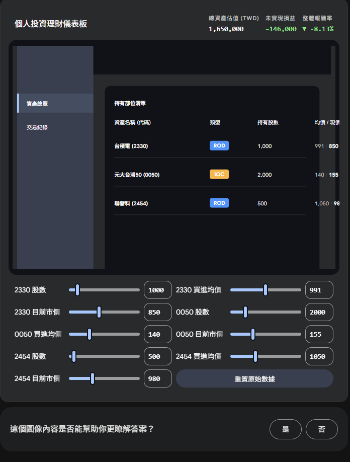

1. TypeScript 必備知識
在這份程式碼中，TS 扮演了「防呆防錯」的保全角色。你需要掌握：

    - Interface (介面) 與 Type Aliases (型別別名)：
        - 了解如何用 interface 定義物件的形狀（例如 Asset 裡面要有 name, amount 等）。

        - 了解如何用 type 建立聯集型別（Union Types），例如 type OrderType = 'ROD' | 'IOC' | 'FOK'，這能確保你打錯字時編譯器會報錯。

    - Generics (泛型 <T>)：

        - 程式碼中到處都是角括號。你需要知道 `useState<Asset[]>` 是告訴 React「這個狀態專門用來裝 Asset 陣列」。

        - `ColumnsType<Asset>` 則是告訴 AntD「這個表格要處理的資料是 Asset 格式」。

    - Utility Types (工具型別 - Omit)：

        - 在 AddAssetModalProps 中用到了 Omit<Asset, 'id' | 'key'>。你需要懂這代表「我要一個跟 Asset 一模一樣的型別，但請幫我剔除 id 和 key 欄位」（因為新增資料時，ID 是送出後才產生的）。

2. React 必備知識
這裡用到了最現代的 React 開發模式（Functional Components + Hooks）。你需要掌握：

    - 元件與 Props (屬性傳遞)：

        - 理解 `<AddAssetModal open={isModalOpen} onCancel={...} />` 這種「父元件把變數和函數當作 Props 往下傳」的資料流邏輯。

        - 了解 `React.FC<Props>` 的宣告方式。

    - useState (狀態管理)：

        - 布林值控制： 用 setIsModalOpen(true/false) 來控制彈窗的顯示。

        - 陣列更新： 了解為什麼不能直接修改原陣列，而必須用展開語法 setAssets([...assets, newAsset]) 來觸發畫面更新。

    - useMemo (效能優化與衍生狀態)：

        - 了解為什麼「計算總資產」與「計算總損益」的邏輯要包在 useMemo 裡面。這能確保只有在 assets 增減時才重新計算數學，避免元件每次渲染都重算一次。

3. Ant Design 實戰用法
AntD 是這份 Demo 質感的來源，你需要熟悉以下幾個組件的特殊 API：

    - 表格自定義渲染 (Table 的 columns.render)：

        - 這是最重要的能力！原本的表格只能顯示純文字，你需要學會如何透過 render: (text, record) => <Tag>{text}</Tag> 來把文字轉換成有顏色的標籤，或是根據數值正負套用紅綠色。

    - 表單與彈窗聯動 (Form + Modal)：

        - 學習使用 const [form] = Form.useForm() 來綁定表單實體。

        - 了解如何透過 rules={[{ required: true }]} 讓表單自動幫你做「必填驗證」。

        - 掌握如何在 Modal 按下「確認」時，透過 form.validateFields() 一次把所有輸入框的值抓出來。

    - 網格與響應式佈局 (Row & Col)：

        - 看懂 `<Col xs={24} sm={8}>` 的意思：在手機版 (xs) 佔滿全寬 (24 格)，在平板/電腦版 (sm 以上) 佔 1/3 寬度 (8 格)。

    - 設計 Token (theme.useToken) 與 Context (message.useMessage)：

        - 了解如何抽出 AntD 內建的樣式變數（如 colorBgContainer）。

        - 學習如何在畫面上方跳出 message.success('新增成功！') 的提示訊息。

4. 圖片範例

🗺️ 建議閱讀順序 (The Blueprint Approach)
請依照以下 1 到 4 的順序閱讀，這符合資料流動與元件依賴的關係：

第一站：合約與規格 (Data & Types)
👉 檔案：src/types/asset.ts ➔ src/mock/data.ts

為什麼先看這裡？ 在 TypeScript 的世界裡，型別（Types）就是系統的合約。你不先了解「一個資產長什麼樣子」，就無法理解後面那些函數到底在傳遞什麼。

觀察重點： 看看 Asset 這個介面（Interface）有哪些屬性？假資料是如何對應這些屬性的？

第二站：骨架與進入點 (App & Layout)
👉 檔案：src/App.tsx ➔ src/layout/DashboardLayout.tsx

為什麼看這裡？ 這是網頁的入口與大框架。

觀察重點： 看看 App.tsx 是如何把 DashboardLayout 當作外衣包在 Overview 外面的？理解 children 這個 Prop 是如何將畫面「挖空」並填入內容的。

第三站：大腦與中樞神經 (Page Logic)
👉 檔案：src/pages/Overview.tsx

為什麼看這裡？ 這是整個 Demo 的核心大腦，所有的 useState（記憶）和資料計算都在這裡。

觀察重點：

找到 useState，看它存了什麼資料。

找到 useMemo，看它如何計算總資產與損益。

看 return 區塊，觀察它是如何把變數（如 assets）當作 props 傳給底下的子元件（如 AssetTable）。

第四站：四肢與器官 (UI Components)
👉 檔案：src/components/StatCard.tsx ➔ AssetTable.tsx ➔ AddAssetModal.tsx

為什麼最後看？ 因為它們是被動的「展示元件」（Presentational Components）。它們自己不生資料，只負責把拿到的資料畫得漂漂亮亮。

觀察重點： 仔細看每個元件最上面的 interface XXXProps，這就是它們對外要求的「輸入規格」。重點觀察 AssetTable 裡面的 columns.render 是如何操作 AntD 的。